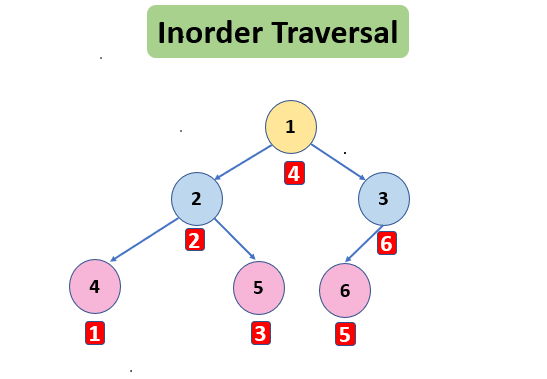

# Binary tree

## Tree structure

```c++
struct TreeNode {
	int val;
	TreeNode *left;
	TreeNode *right;
	TreeNode() : val(0), left(nullptr), right(nullptr) {}
	TreeNode(int x) : val(x), left(nullptr), right(nullptr) {}
	TreeNode(int x, TreeNode *left, TreeNode *right) : val(x), left(left), right(right) {}
};
```

## Traversal in Binary Tree
- ## In order

	-  Left -> mid -> right
	- 
		## Iterative code
		```c++
		vector<int> inorderTraversal(TreeNode* root) {
		vector<int> v;
		stack <TreeNode*> st;
		TreeNode* node = root;
		if(root==NULL)return v;
		while(node!=NULL || !st.empty())
		{
			if(node==NULL){
				// if(st.empty())break;
				node = st.top();
				st.pop();
				v.push_back(node->val);
				node=node->right;
			}
			else{
				st.push(node);
				node=node->left;
			}
		}
		return v;
		}
	```
	- ## Explanation
			- <u>Remember! left --> mid --> right</u>
			1. if node != NULL keep adding elements to the stack and node->left. 
			2. if node is NULL , access the parent node (aka top of stack)  then print and pop the node.
			3. Now node ->right and go to <u>step 1</u>.
			4. repeat until stack isn't empty and node!=NULL.
	- ### Recursive code

	```c++
	 
	vector <int> v;
	void inorder(TreeNode* root)
	{
		if(root==NULL)
			return;
		inorder(root->left);
		v.push_back(root->val);
		inorder(root->right);
	}
	vector<int> inorderTraversal(TreeNode* root) {
		inprder(root);
		return v;
	
	}
	```


	- #### Explanation
		- <u>Remember! left --> mid --> right</u>
		1.  recursion tree keeps moving to the left
		2.  one the NULL node is reached , it backtracks to the parent node and that is the  left most node.
		3. then node->right if not NULL => <u>point 1</u> , else Backtracks to the parent node(this now becomes the left/ subtree)
		4. Left done , the current node is appended , then node->right =><u>point 1</u> 
---
- ## Pre Order
---
- ## Post Order
---
- ## LevelOrder
	- **aka BFS(Breadth First Search)**
	- each tree level from left to right
	**Approach**:
	- store the current level in queue
	- store the size of queue
	- in-queue the ->left and ->right nodes (if exist) of each node for <u>size</u> number of nodes while popping those nodes and storing their value in another vector (which will store the current level)
	- now the queue holds every node at next level

 
	**Code :**
	```c++
	vector<vector<int>> levelOrder(TreeNode* root) {
        TreeNode* node = root;
        queue<TreeNode*> q;
        vector <vector<int>> v;
        if(node==NULL)return v;
        q.push(node);
        while(q.size())
        {
            vector <int> v1;
            int len=q.size();
            for(int i= 0 ; i < len;i++)
            {
                TreeNode* temp=q.front();
                v1.push_back(temp->val);
                if(temp->left!=NULL)
                {
                    q.push(temp->left);
                }if(temp->right!=NULL)
                {
                    q.push(temp->right);
                }
                q.pop();
            }
            v.push_back(v1);
        }
        return v;
    }
	```
---


## LCA : Lowest Common Ancestor
- 