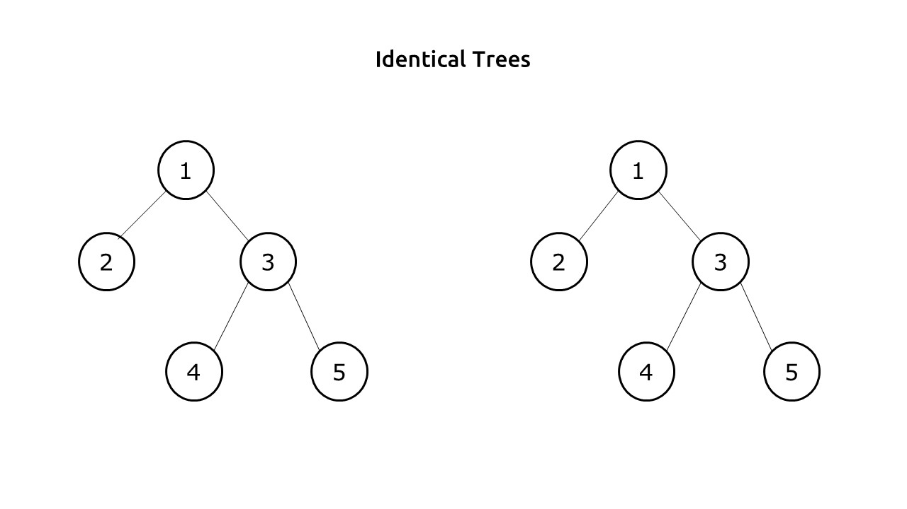
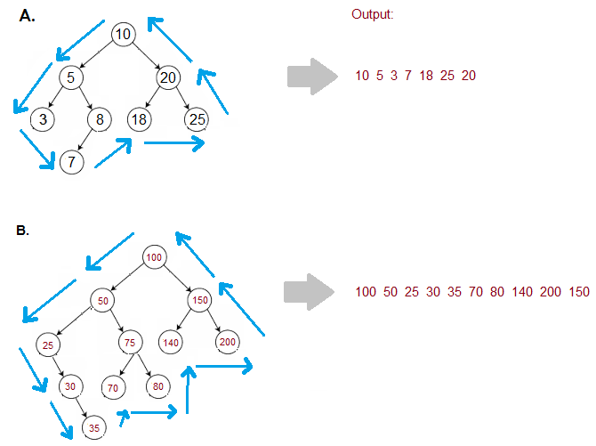
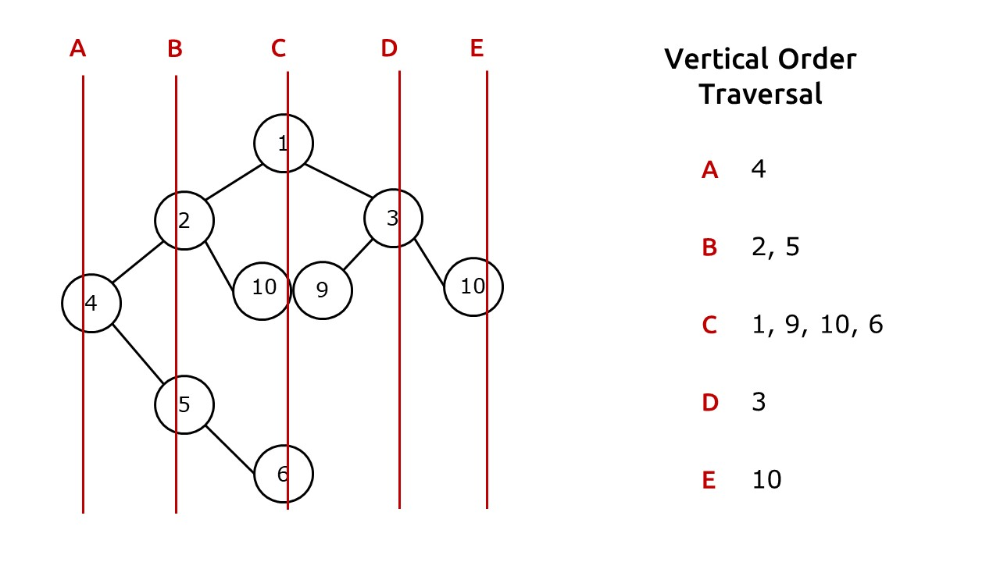

## [Height of Binary tree]()


```c++
int maxheight(TreeNode* root)
{
	auto node = root;
	if(node==NULL)
	{
		return 0;
	}
	int lh=maxheight(node->left);
	int rh=maxheight(node->right);
	return max(lh,rh)+1;
}
```
### time complexity analysis:
- for optimization - Post order traversal is used to calculate max height while traversing.
- max height is compared at each node
- **Time** : O(N)  - traversal takes O(N) and height is compared during traversal.
- **Space** : O(1) Extra Space + O(H) Recursion Stack space, where **“H”**  is the height of the binary tree.
	- worst case **O(N)** skewed tree.

---
---
## [Balanced Binary Tree](https://leetcode.com/problems/balanced-binary-tree/)
- Balanced tree => at any node , **abs(Left height - Right height) <=1** .

- ### Naive approach:
	- traverse to each node using isbalanced function
	- calculate left and right maxdepth using maxheight function for each node.
	- check if balanced or not
```c++
// (lh-rh)<=1 at any node
    int maxheight(TreeNode* root) {
        auto node = root;
        if(node==NULL)return 0;
        int lh = maxheight(node->left);
        int rh = maxheight(node->right);
        return max(lh,rh)+1;
        // if(lh==-1 || rh == -1)return -1;
        // if(abs(lh-rh)>1)return -1;
    }
  
    bool isBalanced(TreeNode* root) {
        auto node = root;
        if(node==NULL)return true;
        int lh=maxheight(node->left);
        int rh=maxheight(node->right);
        if(abs(lh-rh)>1)return false;
        bool l = isBalanced(node->left);
        bool r = isBalanced(node->right);
        return l and r;
        //this solution will take O(N){for traversal} * O(N){for calc max height of a subtree}
    }
```

**Time : O(N^2)** ( For every node, Height Function is called which takes O(N) Time. Hence for every node it becomes N*N ) 

**Space : O(1)** ( Extra Space ) **+ O(H)** ( Recursive Stack Space where **“H”** is the height of tree ).
- worst case **O(N)** for skewed tree.

---

### Optimized Approach:
- check the condition at each node itself while traversing rather than calculating maxheights at each nodes
```c++
int check(TreeNode* root) {
        // (lh-rh)<=1 at any node
        auto node = root;
        if (node==NULL)return 0;
        int lh = check(node->left);
        if(lh == -1)return -1;
        int rh = check(node->right);
        if(rh == -1)return -1;
        if(abs(lh-rh)>1)return -1;
        return max(lh , rh)+1;
    }

    bool isBalanced(TreeNode* root) {
        return check(root)!=-1;
    }
};
```
- ### Analysis :
	- **Time :** O(N) .
	- Space :** O(1) Extra Space + O(H) Recursion Stack space (Where “H”  is the height of binary tree).
		-  worst case  **O(N)** for skewed tree.

---
---
## [ Diameter of Binary Tree](https://leetcode.com/problems/diameter-of-binary-tree/)
- calculate left max height and right max height at each node using traversal and store the maximum of  **edges on left + edges on right** for each node.


```c++
int ans=0;
    //length of path here = number of edges in path
    int maxheight(TreeNode* root)
    {
        auto node = root;
        if(node==NULL)
        {
            return 0;
        }
        int lh=maxheight(node->left);
        int rh=maxheight(node->right);
        ans=max(ans,lh+rh);
        return max(lh,rh)+1;
    }
    int diameterOfBinaryTree(TreeNode* root) {
        maxheight(root);
        return ans;
    }
```
---
### Explanation:
- **Time :** O(N) 
- **Space :** O(1) Extra Space + O(H) Recursion Stack space (Where **“H”** is the height of binary tree )
	-  worst case (skewed tree), space complexity can be O(N).
---
---
## [Max path sum](https://leetcode.com/problems/binary-tree-maximum-path-sum/)
- Similar to diameter , but add and maximize path sum instead of branch height.
- 
- **Code:**

```c++
int maxi=INT_MIN;
    int path(TreeNode* root)
    {
        auto node = root;
        if(node==NULL)return 0;
        int lsum= max(0 , path(node->left)); #<----
        int rsum=max(0, path(node->right)); #<----
        maxi=max(maxi,node->val + lsum + rsum);
        return node->val + max(lsum,rsum);
    }
    int maxPathSum(TreeNode* root) {
        path(root);
        return maxi;
    }
```
- NOTE: the max is taken if incase **lsum** or **rsum** returns negative value , we need to maximize the sum , so to ignore those values , we add zero instead.
- here we're storing the max value in a static global variable.
---
- ### Analysis :
	- **Time : O(N)**.
			- Reason: We are doing a tree traversal.
	- **Space : O(H)** H = height of the binary tree
		-  worst case (skewed tree), space complexity can be O(N).
---
---

## [Identical Trees](https://leetcode.com/problems/same-tree/)
- **Conditions :**
	1. value of a node in T1 == value of the corresponding node in T2
	2. left subtree of the corresponding nodes of trees T1 and T2 must be identical
	3. same for right subtree
	
```c++
bool isSameTree(TreeNode* p, TreeNode* q) {
if(p==NULL || q==NULL) return p==q;
	return (p->val == q->val) && isSameTree(p->left,q->left) && isSameTree(p->right,q->right);
}
```
---
- ### Analysis :
	- **Time : O(N)**.
			- Reason: We are doing a tree traversal.
	- **Space : O(H)** H = height of the binary tree
		-  worst case (skewed tree), space complexity can be O(N).
---
---

## [Zig-Zag traversal](https://leetcode.com/problems/binary-tree-zigzag-level-order-traversal/description/)
- like [level order](BinaryTree/Binarytree.md) but print from left to right and from right to left alternatively
- Naive approach - traverse like level order with a flag variable to reverse the vector before appending alternatively
- instead , create an array of fixed size (== size of each level) and using a flag add elements <u>from size-1 to 0</u> or <u>from 0 to size-1</u> (alternatively)
```c++
vector<vector<int>> zigzagLevelOrder(TreeNode* root) {
        queue <TreeNode*> q;
        auto node = root;
        bool flag=false;
        vector <vector <int>> v;
        if(node==NULL)return v;
        q.push(node);
        while(!q.empty())
        {
            int size=q.size();
            flag^=true;
            vector <int> level(size);
            for(int i = 0 ; i < size ; i++)
            {
                auto temp=q.front();
                if(flag)level[i]=temp->val;
                else level[size-i-1]=temp->val;
                if(temp->left!=NULL)q.push(temp->left);
                if(temp->right!=NULL)q.push(temp->right);
                q.pop();
            }
            v.push_back(level);
        }
        return v;
    }
```
### Time and Space Analysis:
- **Time Complexity: O(N)**  since traversing through each node only once  
- **Space Complexity: O(N)**
---
---

## [Boundary Traversal](https://www.codingninjas.com/studio/problems/boundary-traversal-of-binary-tree_790725)

- ### Approach:
	- first find the left boundary, <u>excluding the leaf and root nodes</u> 
	- then find the leaf nodes
	- then the right boundary , excluding leaf and root nodes
	- **NOTE :** The order must be :
		- left boundary top to bottom 
		- leaf nodes , left to right 
		- right boundary bottom to top 
- **Code :**
```c++
vector<int> v;
void dfsleaf(TreeNode<int> *node)
{
    if(!node)return;
    dfsleaf(node->left);
    dfsleaf(node->right);
    if(!node->left && !node->right)v.push_back(node->data);
}
void dfsleft(TreeNode<int> *node)
{
    if(!node)return;
    if(node->left || node->right)v.push_back(node->data);//<------
    if(node->left)dfsleft(node->left);
    else dfsleft(node->right);
}
void dfsright(TreeNode<int> *node)
{
    if(!node)return;
    if(node->right)dfsright(node->right);
    else dfsright(node->left);
    if(node->left || node->right)v.push_back(node->data);//<------
  
}
vector<int> traverseBoundary(TreeNode<int> *root)
{
    auto node = root;
    v.push_back(node->data);
    dfsleft(node->left);
    dfsleaf(node);
    dfsright(node->right);    
    return v;
}
```
- **Explanation :**
	- dfs leaf calculates leaf nodes i.e., no further branches
	- while pushing in vector in dfs left and dfs right , we're excluding leaf nodes
	- observe the difference in positions of the pushback statement in dfsleft and dfsright
		- if dfsleft, its written before accessing further branches , to push while traversing
		- in dfsright, its written after accessing branches, to push while backtracking(to maintain the order for the desired output i.e., bottom to top)
- ### Analysis :
	- **Time : O(N)** - O(N) *(dfsleaf)* + O(H) *(dfsleft)* + O(H) *(dfsright)* = O(N)
	- **Space : O(H)** - recursion stack *(worst case = O(N) i.e., skewed tree)*

## [Vertical Order Traversal](https://leetcode.com/problems/vertical-order-traversal-of-a-binary-tree/)

- Vertical Order Traversal, as the name suggests is a traversal in which we divide the binary tree in verticals from left to right, and in every vertical, we print the nodes from top to bottom.


**Note:**
- There can be duplicate values among the nodes (here 10 is repeated twice).
- If two or more nodes are overlapping at the same position(here 10 and 9), then they will be printed in ascending order.
- *vertical level = column index*
- *horizontal level = row index*
---
### Solution - 
- using dfs wont work (why?)
- level order traversal while storing horizontal and vertical level of each node

#### Solution -1 :
- precompute horizontal width of binary tree using dfs.
- while applying level order traversal , use 2 query data structures , 1 to store node and another to store the corresponding index(vertical level)
- in each level , create a hash vector of size = horizontal width of tree with initial values as zero
	- as we add elements to our output vector , increase the corresponding index in our hash vector
	- if $hash vector[top]$ > 0 ,then  $sort(v[top].end() - hashvector[top] , v.end())$ i.e., sort the elements whose vertical and horizontal level are same
 ```c++
int min1=0,max1=0;
void dfs(TreeNode* node,int pos)
{
	if(!node)
	{
		return;
	}
	dfs(node->left,pos-1);
	dfs(node->right,pos+1);
	min1=min(pos,min1);
	max1=max(pos,max1);
}

vector<vector<int>> verticalTraversal(TreeNode* root) {
	auto node=root;
	dfs(node,0);
	queue <TreeNode*>q;
	queue <int>q1;
	vector<vector<int>> v(abs(min1)+max1+1);
	if(!node)return v;
	q.push(node);//storing node
	q1.push(abs(min1));//corresponding vertical level aka column index
	while(q.size())
	{
		vector<int> level(abs(min1)+max1+1,0); //hash vector
		int size=q.size();

		for(int i = 0 ; i < size ; i++)
		{
			auto temp=q.front();
			int top=q1.front();
			v[top].push_back(temp->val);
			level[top]++;
			sort(v[top].end()-level[top],v[top].end()); // sorting in same row , col
			if(temp->left)
			{
				q.push(temp->left);
				q1.push(top-1);
			}
			if(temp->right)
			{
				q.push(temp->right);
				q1.push(top+1);
			}
			q.pop();
			q1.pop();
		}
	}
	return v;
}
```
### Analysis:
- **Time : O(N)** - `O(N) + O(log N * N * N)`
- **Space : O(N)**
---
### Solution -2:
- use `map` data-structure instead
-  $map<vertical,map<level,multiset>>$
- firstly store every element with corresponding vertical and horizontal index in map which will sort in order of:
	1. vertical level
	2. horizontal level
	3. numerical value
```c++
vector<vector<int>> verticalTraversal(TreeNode* root) {
	map<int, map<int, multiset<int>>>nodes;
	queue<pair<TreeNode*, pair<int, int>>>q;
	q.push({root, {0, 0}});

	while(!q.empty())//level order
	{
		auto temp = q.front();
		q.pop();
		auto node = temp.first;
		int x = temp.second.first;
		int y = temp.second.second;
		nodes[x][y].insert(node->val);

		if(node->left)
		{
			q.push({node->left, {x-1, y+1}});
		}
		if(node->right)
		{
			q.push({node->right, {x+1, y+1}});
		}

	}

	vector<vector<int>>ans;
	for(auto &column : nodes)
	{
		vector<int>col;
		for(auto &row : column.second)
		{
			col.insert(col.end(), row.second.begin(), row.second.end());
		}

		ans.push_back(col);
	}

	return ans;
}
```
### Analysis :
- **Time : `O(N*log n * log n * log n)`** 
- **Space : O(N)**

---
### Alternative approach
- use dfs instead of level order
- instead of storing in map , create a vector of array of size 3
- #### Time complexity analysis:
	- each search operation will occur in `O(1)` rather than `O(log N *log N * log N)` 
	- overall time =` O(N)` + `O(log N * log N * log N)` 
```c++
vector<array<int,3>> m;
int mn = 100000;
int mx = -100000;

void dfs(TreeNode *node, int r, int c) {
	if (!node) {
		return;
	}
	m.push_back({c , r, node->val});
	dfs(node->left, r + 1, c - 1);
	dfs(node->right, r + 1, c + 1);
	mn = min(mn, c);
	mx = max(mx, c);
}

vector<vector<int>> verticalTraversal(TreeNode* root) {
	dfs(root, 0, 0);
	vector<vector<int>> ret(mx - mn + 1);
	sort(m.begin(), m.end());
	for (auto [c , r , v] :  m) {
		ret[c - mn].push_back(v);
	}
	return ret;
}
```

## [Top View Of Binary Tree](https://www.codingninjas.com/studio/problems/top-view-of-binary-tree_799401)
- set of nodes visible when the tree is viewed from the top

- dfs didn't work
- try using bfs 
- ---
### Approach:
- find horizontal width aka number of columns
- use `queue<pair<TreeNode*,int>>` or 2 queues
- apply bfs
- store the first occurrence of any column index (use a hash array)

```c++
int min1 = 0 , max1 = 0;
void width(TreeNode<int> * node,int index)
{
    if(!node)return;
    width(node->left,index-1);
    width(node->right,index+1);
    min1=min(min1,index);
    max1=max(max1,index);
}
  
vector<int> getTopView(TreeNode<int> *root)
{
    auto node=root;
    width(node , 0);
    int w=max1-min1+1;
    vector<int> hash(w,0) , ans(w);
    if(!node)return ans;
    queue <pair<TreeNode<int>*,int>> q;
    q.push(make_pair(node,-1*min1));
    while(q.size())
    {
        int size=q.size();
        for(int i = 0 ; i <size ; i++)
        {
            auto it = q.front();
            TreeNode<int>* temp=it.first;
            int index = it.second;
            if(!hash[index])
            {
                hash[index]=1;
                ans[index]=temp->data;
            }
            if(temp->left)q.push({temp->left , index-1});
            if(temp->right)q.push({temp->right , index+1});
            q.pop();
        }
    }
    return ans;
}
```

### Analysis:
-  **TIme O(N) :** `O(N)` during dfs for finding width  + `O(N)` for level order
- **Space O(N) :** queue
---


## [Bottom view of Binary Tree](https://www.codingninjas.com/studio/problems/bottom-view-of-binary-tree_893110)

## [left view](https://www.codingninjas.com/studio/problems/left-view-of-binary-tree_625707)
## [Root to Node Path](https://www.codingninjas.com/studio/problems/all-root-to-leaf-paths-in-binary-tree._983599)
**Note:**
- No two nodes in the tree have the same data value.
- It is assured that the node V is present and a path always exists.


```c++
vecto<int> v;
bool dfs(BinaryTreeNode<int> * node,int &x)
{
	if(!node)return false;
	v.push_bacK(node->data);
	if(node->data==x) return true;
	if(dfs(node->left,x) || dfs(npde->right,x))return true;
	v.pop_back();
	return false;
	
}
vector <int> allRootToLeaf(BinaryTreeNode<int> * root , int find) 
{
    BinaryTreeNode<int>*node=root;
    dfs(node,find);
    return v;
}
```

### ROOT TO ALL LEAF NODES PATH:
- Approach similar to subset generation
- Once we reach at a leaf node , store the string

```c++
vector<string> v;
string s;
void dfs(BinaryTreeNode<int>* node)
{
    if(!node)return;
    int x=node->data;
    string s1;
    while(x)
    {
        s1.push_back((char)(x%10 + (int)'0'));
        x/=10;
    }
    while(s1.size())
    {
        s.push_back(s1.back());
        s1.pop_back();
    }
    s.push_back(' ');
    dfs(node->left);
    dfs(node->right);
    if(!node->left and !node->right)
    {
        v.push_back(s);
    }
    s.pop_back();
    while(s.back()!=' ' && s.size())
    {
        s.pop_back();
    }
  
}
  
vector <string> allRootToLeaf(BinaryTreeNode<int> * root) 
{
    BinaryTreeNode<int>*node=root;
    dfs(node);
    return v;
}
```


## [LCA of a Binary Tree](https://leetcode.com/problems/lowest-common-ancestor-of-a-binary-tree/)
- The **Lowest Common Ancestor** is defined between two nodes x and y as the lowest node in T that has both x and y as descendants (where we allow a node to be a descendant of itself).

- Intution:
	1. Search left sub tree
	2. Searcj right sub tree
	3. if none , root is the LCA