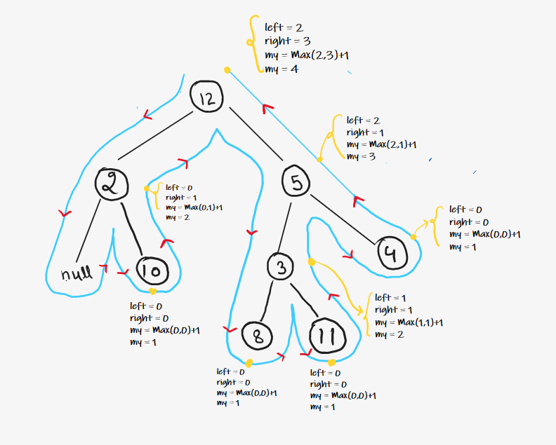
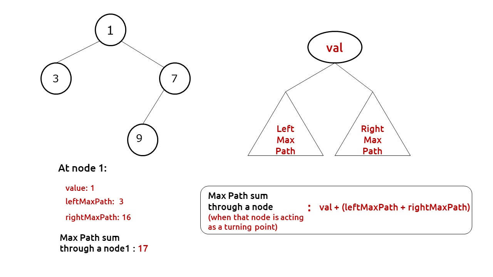

## [Height of Binary tree]()


```c++
int maxheight(TreeNode* root)
{
	auto node = root;
	if(node==NULL)
	{
		return 0;
	}
	int lh=maxheight(node->left);
	int rh=maxheight(node->right);
	return max(lh,rh)+1;
}
```
### time complexity analysis:
- for optimization - Post order traversal is used to calculate max height while traversing.
- max height is compared at each node
- **Time** : O(N)  - traversal takes O(N) and height is compared during traversal.
- **Space** : O(1) Extra Space + O(H) Recursion Stack space, where **“H”**  is the height of the binary tree.
	- worst case **O(N)** skewed tree.

---
---
## [Balanced Binary Tree](https://leetcode.com/problems/balanced-binary-tree/)
- Balanced tree => at any node , **abs(Left height - Right height) <=1** .

- ### Naive approach:
	- traverse to each node using isbalanced function
	- calculate left and right maxdepth using maxheight function for each node.
	- check if balanced or not
```c++
// (lh-rh)<=1 at any node
    int maxheight(TreeNode* root) {
        auto node = root;
        if(node==NULL)return 0;
        int lh = maxheight(node->left);
        int rh = maxheight(node->right);
        return max(lh,rh)+1;
        // if(lh==-1 || rh == -1)return -1;
        // if(abs(lh-rh)>1)return -1;
    }
  
    bool isBalanced(TreeNode* root) {
        auto node = root;
        if(node==NULL)return true;
        int lh=maxheight(node->left);
        int rh=maxheight(node->right);
        if(abs(lh-rh)>1)return false;
        bool l = isBalanced(node->left);
        bool r = isBalanced(node->right);
        return l and r;
        //this solution will take O(N){for traversal} * O(N){for calc max height of a subtree}
    }
```

**Time : O(N^2)** ( For every node, Height Function is called which takes O(N) Time. Hence for every node it becomes N*N ) 

**Space : O(1)** ( Extra Space ) **+ O(H)** ( Recursive Stack Space where **“H”** is the height of tree ).
- worst case **O(N)** for skewed tree.

---

### Optimized Approach:
- check the condition at each node itself while traversing rather than calculating maxheights at each nodes
```c++
int check(TreeNode* root) {
        // (lh-rh)<=1 at any node
        auto node = root;
        if (node==NULL)return 0;
        int lh = check(node->left);
        if(lh == -1)return -1;
        int rh = check(node->right);
        if(rh == -1)return -1;
        if(abs(lh-rh)>1)return -1;
        return max(lh , rh)+1;
    }

    bool isBalanced(TreeNode* root) {
        return check(root)!=-1;
    }
};
```
- ### Analysis :
	- **Time :** O(N) .
	- Space :** O(1) Extra Space + O(H) Recursion Stack space (Where “H”  is the height of binary tree).
		-  worst case  **O(N)** for skewed tree.

---
---
## [ Diameter of Binary Tree](https://leetcode.com/problems/diameter-of-binary-tree/)
- calculate left max height and right max height at each node using traversal and store the maximum of  **edges on left + edges on right** for each node.


```c++
int ans=0;
    //length of path here = number of edges in path
    int maxheight(TreeNode* root)
    {
        auto node = root;
        if(node==NULL)
        {
            return 0;
        }
        int lh=maxheight(node->left);
        int rh=maxheight(node->right);
        ans=max(ans,lh+rh);
        return max(lh,rh)+1;
    }
    int diameterOfBinaryTree(TreeNode* root) {
        maxheight(root);
        return ans;
    }
```
---
### Explanation:
- **Time :** O(N) 
- **Space :** O(1) Extra Space + O(H) Recursion Stack space (Where **“H”** is the height of binary tree )
	-  worst case (skewed tree), space complexity can be O(N).
---
---
## [Max path sum](https://leetcode.com/problems/binary-tree-maximum-path-sum/)
- Similar to diameter , but add and maximize path sum instead of branch height.
- 
- **Code:**

```c++
int maxi=INT_MIN;
    int path(TreeNode* root)
    {
        auto node = root;
        if(node==NULL)return 0;
        int lsum= max(0 , path(node->left)); #<----
        int rsum=max(0, path(node->right)); #<----
        maxi=max(maxi,node->val + lsum + rsum);
        return node->val + max(lsum,rsum);
    }
    int maxPathSum(TreeNode* root) {
        path(root);
        return maxi;
    }
```
- NOTE: the max is taken if incase **lsum** or **rsum** returns negative value , we need to maximize the sum , so to ignore those values , we add zero instead.
- here we're storing the max value in a static global variable.
---
- ### Analysis :
	- **Time : O(N)**.
			- Reason: We are doing a tree traversal.
	- **Space : O(H)** H = height of the binary tree
		-  worst case (skewed tree), space complexity can be O(N).