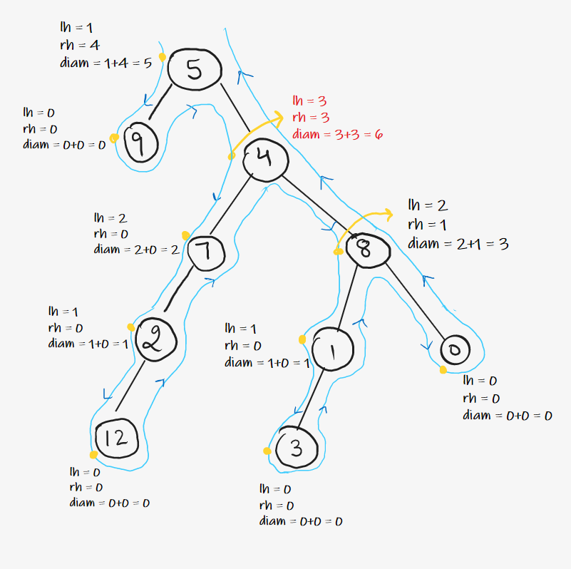

## [Height of Binary tree]()


```c++
int maxheight(TreeNode* root)
{
	auto node = root;
	if(node==NULL)
	{
		return 0;
	}
	int lh=maxheight(node->left);
	int rh=maxheight(node->right);
	return max(lh,rh)+1;
}
```
### time complexity analysis:
- for optimization - Post order traversal is used to calculate max height while traversing.
- max height is compared at each node
- **Time** : O(N)  - traversal takes O(N) and height is compared during traversal.
- **Space** : O(1) Extra Space + O(H) Recursion Stack space, where **“H”**  is the height of the binary tree.
	- worst case **O(N)** skewed tree.

---
---
## [Balanced Binary Tree](https://leetcode.com/problems/balanced-binary-tree/)
- Balanced tree => at any node , **abs(Left height - Right height) <=1** .

- ### Naive approach:
	- traverse to each node using isbalanced function
	- calculate left and right maxdepth using maxheight function for each node.
	- check if balanced or not
```c++
// (lh-rh)<=1 at any node
    int maxheight(TreeNode* root) {
        auto node = root;
        if(node==NULL)return 0;
        int lh = maxheight(node->left);
        int rh = maxheight(node->right);
        return max(lh,rh)+1;
        // if(lh==-1 || rh == -1)return -1;
        // if(abs(lh-rh)>1)return -1;
    }
  
    bool isBalanced(TreeNode* root) {
        auto node = root;
        if(node==NULL)return true;
        int lh=maxheight(node->left);
        int rh=maxheight(node->right);
        if(abs(lh-rh)>1)return false;
        bool l = isBalanced(node->left);
        bool r = isBalanced(node->right);
        return l and r;
        //this solution will take O(N){for traversal} * O(N){for calc max height of a subtree}
    }
```

**Time : O(N^2)** ( For every node, Height Function is called which takes O(N) Time. Hence for every node it becomes N*N ) 

**Space : O(1)** ( Extra Space ) **+ O(H)** ( Recursive Stack Space where **“H”** is the height of tree ).
- worst case **O(N)** for skewed tree.

---

### Optimized Approach:
- check the condition at each node itself while traversing rather than calculating maxheights at each nodes
```c++
int check(TreeNode* root) {
        // (lh-rh)<=1 at any node
        auto node = root;
        if (node==NULL)return 0;
        int lh = check(node->left);
        if(lh == -1)return -1;
        int rh = check(node->right);
        if(rh == -1)return -1;
        if(abs(lh-rh)>1)return -1;
        return max(lh , rh)+1;
    }

    bool isBalanced(TreeNode* root) {
        return check(root)!=-1;
    }
};
```
- ### Analysis :
	- **Time :** O(N) .
	- Space :** O(1) Extra Space + O(H) Recursion Stack space (Where “H”  is the height of binary tree).
		-  worst case  **O(N)** for skewed tree.

---
---
## [ Diameter of Binary Tree](https://leetcode.com/problems/diameter-of-binary-tree/)
- calculate left max height and right max height at each node using traversal and store the maximum of  **edges on left + edges on right** for each node.


```c++
int ans=0;
    //length of path here = number of edges in path
    int maxheight(TreeNode* root)
    {
        auto node = root;
        if(node==NULL)
        {
            return 0;
        }
        int lh=maxheight(node->left);
        int rh=maxheight(node->right);
        ans=max(ans,lh+rh);
        return max(lh,rh)+1;
    }
    int diameterOfBinaryTree(TreeNode* root) {
        maxheight(root);
        return ans;
    }
```
---
### Explanation:
- **Time :** O(N) 
- **Space :** O(1) Extra Space + O(H) Recursion Stack space (Where **“H”** is the height of binary tree )
	-  worst case (skewed tree), space complexity can be O(N).
---
---
## [Max path sum](https://leetcode.com/problems/binary-tree-maximum-path-sum/)
- Similar to diameter , but add and maximize path sum instead of branch height.
- 
- **Code:**

```c++
int maxi=INT_MIN;
    int path(TreeNode* root)
    {
        auto node = root;
        if(node==NULL)return 0;
        int lsum= max(0 , path(node->left)); #<----
        int rsum=max(0, path(node->right)); #<----
        maxi=max(maxi,node->val + lsum + rsum);
        return node->val + max(lsum,rsum);
    }
    int maxPathSum(TreeNode* root) {
        path(root);
        return maxi;
    }
```
- NOTE: the max is taken if incase **lsum** or **rsum** returns negative value , we need to maximize the sum , so to ignore those values , we add zero instead.
- here we're storing the max value in a static global variable.
---
- ### Analysis :
	- **Time : O(N)**.
			- Reason: We are doing a tree traversal.
	- **Space : O(H)** H = height of the binary tree
		-  worst case (skewed tree), space complexity can be O(N).
---
---

## [Identical Trees](https://leetcode.com/problems/same-tree/)
- **Conditions :**
	1. value of a node in T1 == value of the corresponding node in T2
	2. left subtree of the corresponding nodes of trees T1 and T2 must be identical
	3. same for right subtree
	
	```c++
	bool isSameTree(TreeNode* p, TreeNode* q) {
        if(p==NULL || q==NULL) return p==q;
        return (p->val == q->val) && isSameTree(p->left,q->left) && isSameTree(p->right,q->right);
    }
    ```
---
- ### Analysis :
	- **Time : O(N)**.
			- Reason: We are doing a tree traversal.
	- **Space : O(H)** H = height of the binary tree
		-  worst case (skewed tree), space complexity can be O(N).
---
---

## [Zig-Zag traversal](https://leetcode.com/problems/binary-tree-zigzag-level-order-traversal/description/)
- like [level order](BinaryTree/Binarytree.md) but print from left to right and from right to left alternatively
- Naive approach - traverse like level order with a flag variable to reverse the vector before appending alternatively
- instead , create an array of fixed size (== size of each level) and using a flag add elements <u>from size-1 to 0</u> or <u>from 0 to size-1</u> (alternatively)
```c++
vector<vector<int>> zigzagLevelOrder(TreeNode* root) {
        queue <TreeNode*> q;
        auto node = root;
        bool flag=false;
        vector <vector <int>> v;
        if(node==NULL)return v;
        q.push(node);
        while(!q.empty())
        {
            int size=q.size();
            flag^=true;
            vector <int> level(size);
            for(int i = 0 ; i < size ; i++)
            {
                auto temp=q.front();
                if(flag)level[i]=temp->val;
                else level[size-i-1]=temp->val;
                if(temp->left!=NULL)q.push(temp->left);
                if(temp->right!=NULL)q.push(temp->right);
                q.pop();
            }
            v.push_back(level);
        }
        return v;
    }
```
### Time and Space Analysis:
- **Time Complexity: O(N)**  since traversing through each node only once  
- **Space Complexity: O(N)**
---
---

## [Boundary Traversal](https://www.codingninjas.com/studio/problems/boundary-traversal-of-binary-tree_790725)

- ### Approach:
	- first find the left boundary, <u>excluding the leaf and root nodes</u> 
	- then find the leaf nodes
	- then the right boundary , excluding leaf and root nodes
	- **NOTE :** The order must be :
		- left boundary top to bottom 
		- leaf nodes , left to right 
		- right boundary bottom to top 
- **Code :**
```c++
vector<int> v;
void dfsleaf(TreeNode<int> *node)
{
    if(!node)return;
    dfsleaf(node->left);
    dfsleaf(node->right);
    if(!node->left && !node->right)v.push_back(node->data);
}
void dfsleft(TreeNode<int> *node)
{
    if(!node)return;
    if(node->left || node->right)v.push_back(node->data);//<------
    if(node->left)dfsleft(node->left);
    else dfsleft(node->right);
}
void dfsright(TreeNode<int> *node)
{
    if(!node)return;
    if(node->right)dfsright(node->right);
    else dfsright(node->left);
    if(node->left || node->right)v.push_back(node->data);//<------
  
}
vector<int> traverseBoundary(TreeNode<int> *root)
{
    auto node = root;
    v.push_back(node->data);
    dfsleft(node->left);
    dfsleaf(node);
    dfsright(node->right);    
    return v;
}
```
- **Explanation :**
	- dfs leaf calculates leaf nodes i.e., no further branches
	- while pushing in vector in dfs left and dfs right , we're excluding leaf nodes
	- observe the difference in positions of the pushback statement in dfsleft and dfsright
		- if dfsleft, its written before accessing further branches , to push while traversing
		- in dfsright, its written after accessing branches, to push while backtracking(to maintain the order for the desired output i.e., bottom to top)
- ### Analysis :
	- **Time : O(N)** - O(N) *(dfsleaf)* + O(H) *(dfsleft)* + O(H) *(dfsright)* = O(N)
	- **Space : O(H)** - recursion stack *(worst case = O(N) i.e., skewed tree)*
