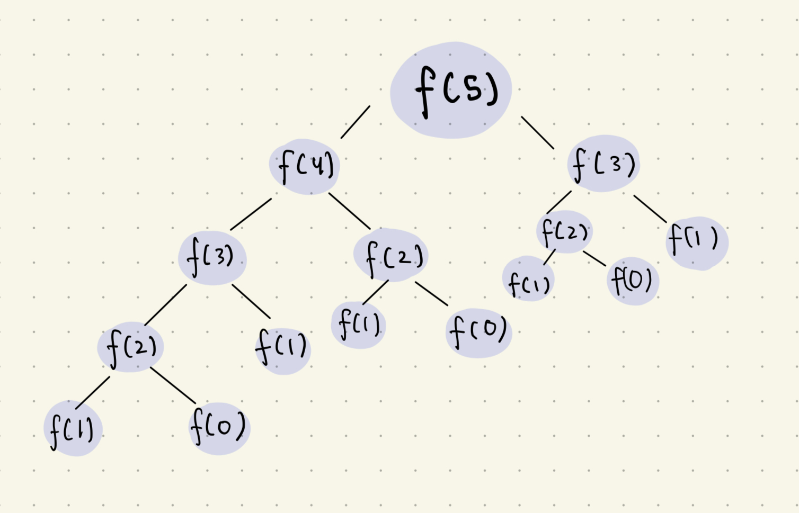

# 1. MEMOIATION - recursion

# 2. TABULATION - iterative

# 3. SPACE OPTIMIZATION

## FIBONACCI SERIES:
- `0 1 1 2 3 4 8 13 21`
- recursive relation becomes **F[n] = F[n-1] +F[n-2]**
- recursion tree:


- we're solving f(2) , f(3) , f(1) again and again , This is called **<u>Overlapping Sub-problems</u>** 
- ### Here comes Memoiation
- We tend to store the values in table/map to avoid overlapping
	- create an array dp[size] initialized with -1
	- if a new problem was solved , 
		- check if its already solved in the array
		- else solve it and update
```c++
#include<bits/stdc++.h>
using namespace std;
  
int fibo(int n , int dp[])
{
        if(n<=1)return n;
        if(dp[n]!=-1)return dp[n];
        return dp[n] = fibo(n-1,dp) + fibo(n-2,dp);
}
int main()
{
        int n;
        cin>>n;
        int dp[n+1];
        memset(dp,-1,sizeof(dp));
        cout<<fibo(n,dp)<<endl;
}
```

### Time :
-  **O(N)** - since recursion works linearly
- **O(N)** `recursion stack space` + **O(N)** `array`

---
## <u>Recursion vs Tabulation</u>

- ### Recursion : top down
	- answer required ---> base case ---> returns answer
	- takes recursion stack space
	
- ### Tabulation : bottom up
	- base case ---> required answer
	- no stack space

## Fibonacci using tabulation:
```c++
#include<bits/stdc++.h>
using namespace std;
  
int main()
{
        int n;
        cin>>n;
        int dp[n+1];
        memset(dp,-1,sizeof(dp));
        dp[0]=0;
        dp[1]=1;
        for(int i = 2 ; i <= n ; i++)
        {
                dp[i]=dp[i-1]+dp[i-2];
        }
        cout<<dp[n];

}
```


