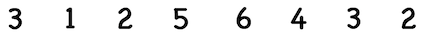
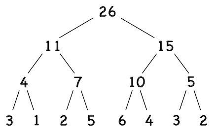
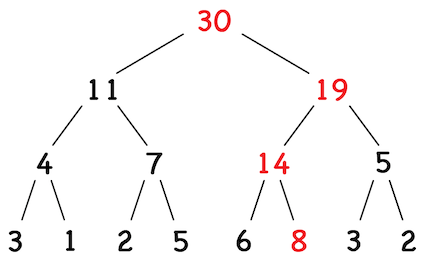
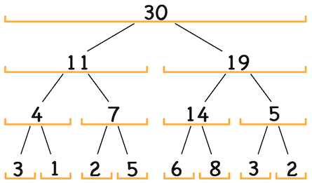
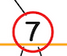
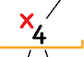

# SEGMENT TREE

- The leaf layer stores the array, and each parent level stores the sum/ (any other associative combination) of the two child nodes
- thus we need to make a complete binary tree
- increase the size of array to the closest power of 2 
- **This wont affect the time complexity of operations since the size will go max up to 2.n**

*array* :

 
 
 

*segment tree* :

# Operations:
## Changing array element
	

- **O(logN)**
## SUM OF SEGMENT L TO R
	

- sum from index 2 to 6
 

- **CASE 1 :**
	
	
	- The segment corresponding to the current node completely lies between L and R
	- **Add value at current node to total sum**
	- **Return!! no need to traverse further**
- **CASE 2 :**
	
	
	- The segment corresponding to the current node lies partially inside the L to R range
	- **Keep traversing**
- **CASE 3 :**
  	
	
	- The segment corresponding to the current node lies completely outside L to R range
	- **Return!! no need to traverse further**
### Time:
- Till we keep getting **case 2**, we'll keep going deeper in the tree
	- Until we either get **case 1** or **case 2**
	- In order for none of the cutoffs to work (**WORST CASE**), the corresponding segment must intersect the query segment
- Thus there can be no more than 2.logN nodes at which cutoffs did not work
- TIME : **O(logN)**

## MINIMUM IN L TO R

- This time create a segment tree, where parent node stores the minimum of its children.
- just like the range sum operation, traverse and find the minimum element.

**NOTE : OTHER THAN ADDn AND MIN, WE CAN USE SEGMENT TREE FOR ANY ASSOCIATIVE OPERATIONS LIKE BITWISE, MUL, ETC**

[IMPLEMENTATION](./IMPLEMENTATION.md)

